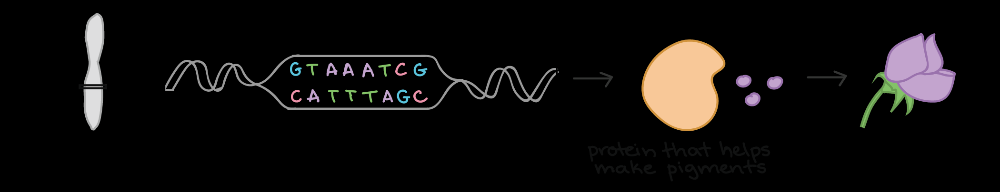
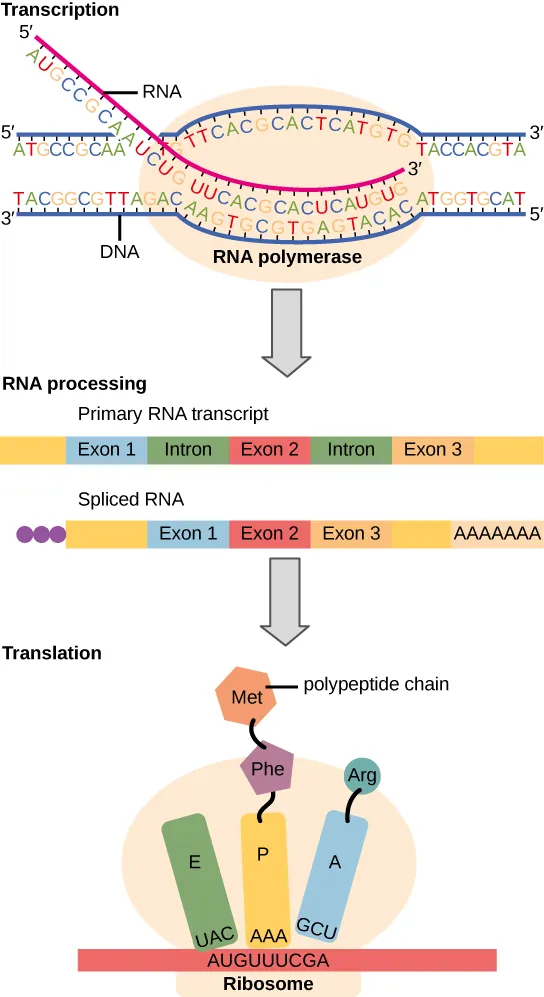
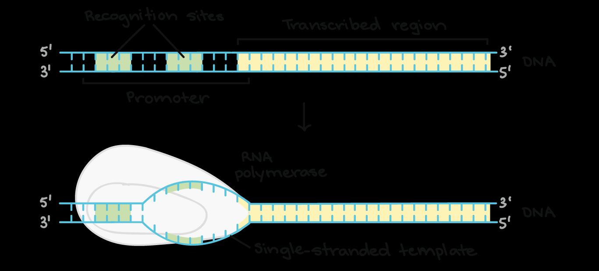
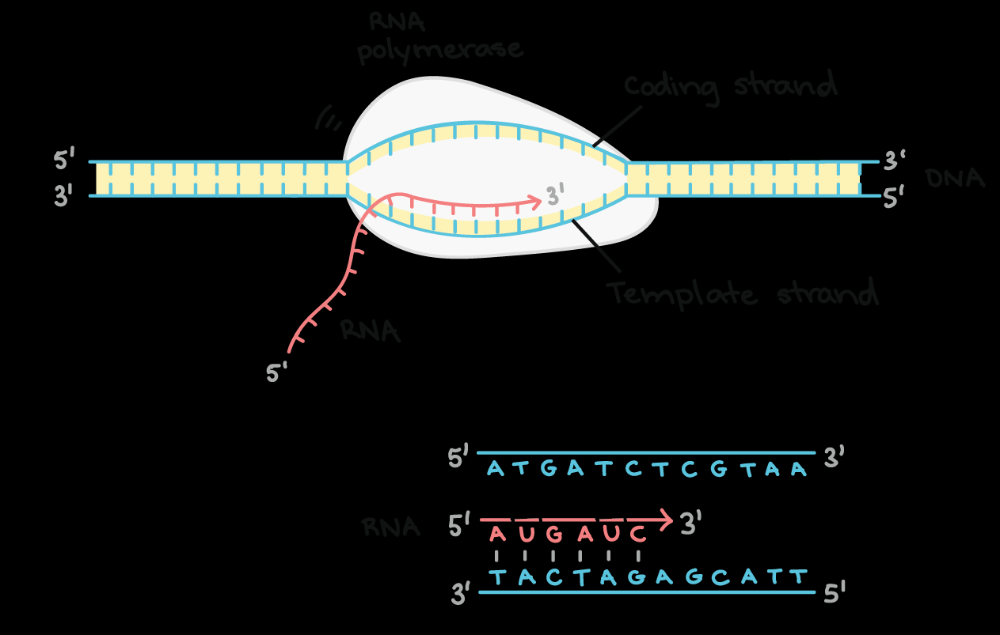
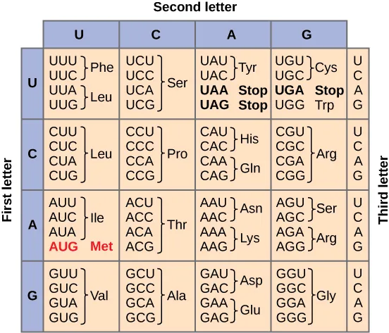

Gambar. Proses bagaimana gen menentukkan fenotipe pada organisme. Gen pada DNA membuat suatu protein. Protein yang dihasilkan kemudian berinteraksi dengan lingkungan seluler untuk menentukan fenotipe.

DNA berfungsi sebagai *blueprint*  dalam kehidupan di Bumi, mewariskan informasi herediter dari generasi ke generasi. DNA memiliki peranan untuk menentukan berbagai sifat pada keturunan, dari warna mata dan rambut pada manusia hingga warna bunga pada tanaman kacang.

Daripada melihat DNA sebagai barisan nukleotida yang terasa acak, DNA ter-organisir menjadi unit fungsional yang dikenal sebagai gen. Setiap gen membawa instruksi untuk melakukan sintesis produk tertentu, seringkali protein. Pada tanaman kacang Mendel, misalnya, sebuah terdapat sebuah gen dalam DNA tanaman kacang yang bertanggung jawab atas produksi protein yang menghasilkan pigmen pada kelopak bunga.

Mayoritas gen mengkodekan protein, atau lebih tepatnya, polipeptida, yang merupakan rantai asam amino. Protein memainkan peran sentral dalam fungsi pada sel; enzim mengkatalisis reaksi kimia, hemoglobin membantu dalam membangun struktur seluler, dan antibodi mempertahankan sistem imun. Protein sebagai aktor utama dalam proses seluler mengarah pada formulasi central dogma pada biologi molekuler.

Central dogma menjelaskan proses perubahan gen hingga menjadi fenotipe yang dimiliki suatu organisme. DNA atau kromosom menyimpan instruksi (gen) untuk membuat protein, dan instruksi ini ditranskripsi menjadi molekul RNA, kemudian diterjemahkan menjadi urutan asam amino untuk membentuk protein. Konsep ini membentuk inti dari biologi molekuler dan menjadi dasar untuk memahami bagaimana informasi genetik diterjemahkan menjadi fenotipe pada organisme.

Gambar. Proses transkripsi dan translasi dalam *central* *dogma*. Dalam proses transkripsi, DNA ditranskripsi menjadi RNA. RNA kemudian ditranslasi menjadi protein pada proses translasi.

Proses yang rumit dalam menerjemahkan DNA menjadi protein melibatkan dua tahap utama:

- Transkripsi, tahapan awal dari proses ekspresi gen, bertujuan untuk membuat salinan RNA dari urutan DNA gen. salinan RNA ini, kita sebut sebagai transkrip, membawa informasi yang diperlukan untuk menyusun polipeptida. Dalam proses ini, enzim RNA polimerase, enzim utama dalam proses transkripsi, menggunakan template DNA untai tunggal (single stranded DNA) untuk mensintesis untai RNA komplementer. Proses transkripsi terdiri dari tiga tahap: inisiasi, elongasi, dan terminasi.

- Translasi, di sisi lain, menerjemahkan informasi pada mRNA untuk membuat protein. mRNA mengkodekan polipeptida melalui kodon, yang merupakan triplet nukleotida RNA yang mewakili suatu asam amino tertentu. Ada 64 kodon secara keseluruhan, dengan satu kodon, AUG, berfungsi sebagai kodon start dan inisiasi sintesis protein, dan tiga lainnya, UAA, UAG, dan UGA, bertindak sebagai kodon stop untuk menandai akhir pembentukan polipeptida. Interaksi antara kodon dan asam amino membentuk kode genetik, memungkinkan sel untuk mendekode mRNA menjadi rantai asam amino.

Berikut adalam penjelasan mengenai setiap tahap dari proses.

# Trankripsi

## Transcription initiation

Gambar. RNA polimerase berikatan dengan DNA pada wilayah yang disebut promoter.

Untuk memulai proses transkripsi suatu gen, RNA Polimerasi terlebih dahulu berikatan dengan DNA gen pada wilayah yang disebut promoter. Secara singkat, promoter memberitahu  ezim RNA Polimerase di mana harus "duduk" pada DNA dan memulai proses transkripsi.

Setiap gen memiliki promotornya sendiri. Promotor memiliki urutan DNA yang memungkinkan RNA Polimerase dan protein pembantu-nya menempel pada DNA. Setelah gelembung transkripsi terbentuk, polimerase dapat mulai melakukan proses transkripsi.

## Elongation

Gambar. RNA polimerase berjalan sepanjang DNA, membaca untai DNA dan menambahkan nukleotida RNA yang sesuai.

Setelah RNA polimerase berada pada posisi di promoter, langkah selanjutnya dapat dimulai. Elongasi adalah tahap ketika untai RNA mulai ditambahkan, berkat penambahan nukleotida baru.

Selama elongasi, RNA polimerase berjalan sepanjang satu untai DNA dengan arah 3' ke 5'. Untuk setiap nukleotida pada cetakan, RNA polimerase menambahkan nukleotida RNA yang cocok (komplementer) ke ujung 3' dari untai RNA.

Hasil mRNA ( messenger RNA) yang terbentuk adalah hampir identik dengan untai DNA non-template, atau coding. Namun, untai RNA memiliki basa urasil (U), berbeda dengan DNA yang memiliki basa timin (T).

## Termination
Enzim RNA polimerase akan terus melakukan transkripsi sampai mendapatkan sinyal untuk berhenti. Proses berakhirnya transkripsi disebut terminasi, dan terjadi setelah polimerase mentranskripsikan urutan DNA yang dikenal sebagai terminator.

mRNA yang dihasilkan perlu melewati pre-mRNA processing sebelum dapat meninggalkan nukleus dan melakukan translasi. Proses ini melibatkan penghapusan intron dan penyambungan ekson (RNA spilcing), serta penambahan cap 5' dan ekor poli-A 3'.

# Translasi

Gambar. Bagian-Bagian yang terlibat dalam proses translasi.

 ## Kode Genetika

Pada mRNA, instruksi untuk membangun polipeptida ditunjukkan dalam bentuk triplet nukleotida yang disebut kodon. terdapat 64 ($4^3$) kodon dengan sebaran: satu  (AUG) untuk memulai proses translasi, 61 kodon yang mengkodekan suatu asam amino, dan tiga kodon untuk mengakhiri proses translasi.

Gambar. Tabel kode genetika.

Hubungan antar kodon pada mRNA dengan asam amino disebut dengan kode genetika.

Pada proses tranlasi, kodon mRNA dibaca secara berurutan (dari ujung 5' ke ujung 3') oleh molekul yang disebut transfer RNA (tRNA) pada ribosom. Setiap tRNA memiliki anticodon, triplet nukleotida yang berikatan dengan kodon mRNA melalui pasangan basa. Ujung lain dari tRNA membawa asam amino yang sudah ditentukan oleh kodon.

## Inisiasi

Untuk memulai translasi, beberapa komponen kunci diperlukan:

- Ribosom, yang terdiri dari dua subunit (besar dan kecil).
- Molekul mRNA yang berisi instruksi untuk sintesis protein.
- Molekul tRNA "inisiasi" yang membawa asam amino pertama dalam protein, yang biasanya metionin (Met).

Selama inisiasi, komponen-komponen ini bersatu untuk membentuk struktur kompleks, yang diperlukan untuk memulai sintesis protein.

## Elongasi

Gambar.  Proses elongasi pertama dalam translasi.

Elongasi adalah tahap kedua dari translasi, di mana rantai polipeptida terbentuk dengan menambahkan asam amino. Selama elongasi, ribosom bergerak sepanjang mRNA, membaca kodon dan menambahkan asam amino yang sesuai ke rantai polipeptida.

Langkah pertama elongasi adalah pengikatan aminoasil-tRNA ke situs A ribosom. Aminoasil-tRNA adalah molekul tRNA yang membawa asam amino tertentu, dan antikodonnya komplementer dengan kodon di situs A mRNA. Pengikatan aminoasil-tRNA ke situs A difasilitasi oleh faktor elongasi.

Setelah aminoasil-tRNA terikat ke situs A, ribosom mengkatalisis pembentukan ikatan peptida antara asam amino yang dibawa oleh aminoasil-tRNA dan rantai polipeptida. Reaksi ini dikatalisis oleh peptidil transferase, enzim yang merupakan bagian dari ribosom.

Setelah ikatan peptida terbentuk, ribosom bergerak satu kodon sepanjang mRNA, menggeser peptidil-tRNA dari situs A ke situs P. Situs A sekarang kosong dan siap menerima aminoasil-tRNA berikutnya. tRNA yang berada di situs P sekarang berada di situs E, dan dilepaskan dari ribosom.

Proses elongasi berlanjut sampai kodon stop tercapai dalam mRNA. Pada saat ini, ribosom melepaskan rantai polipeptida dan terdisosiasi dari mRNA.

## Terminasi
Proses translasi diakhiri ketika kodon stop pada mRNA (UAA, UAG, atau UGA) memasuki situs A. Proses ini dikenal sebagai terminasi.

Kodon stop dikenali oleh protein yang disebut faktor pelepasan, yang pas dengan situs P ribosom. suatu enzim menambahkan molekul air ke asam amino terakhir dari rantai, yang mengakibatkan pemisahan rantai dari tRNA. Protein yang baru disintesis kemudian dilepaskan. Setelah terminasi, subunit ribosom terpisah dari mRNA dan dari satu sama lain.

Setelah rantai polipeptida disintesis, rantai tersebut dapat mengalami berbagai modifikasi untuk menjadi protein yang fungsional. Modifikasi ini meliputi perubahan kimia atau penghapusan asam amino selama dan setelah translasi. Selain itu, rantai polipeptida akan melipat menjadi struktur tiga dimensi. Beberapa protein dapat melipat sendiri, sedangkan yang lain memerlukan bantuan chaperone untuk mencegah lipatan yang salah.

Selain itu, beberapa protein mengandung urutan asam amino tertentu yang mengarahkan mereka ke lokasi akhir mereka dalam sel. Urutan-urutan ini, sering terletak di dekat ujung N- atau C-, bertindak sebagai "tiket kereta" protein ke lokasi yang dimaksudkan.