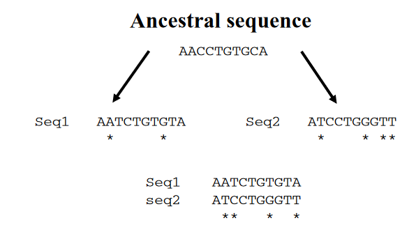
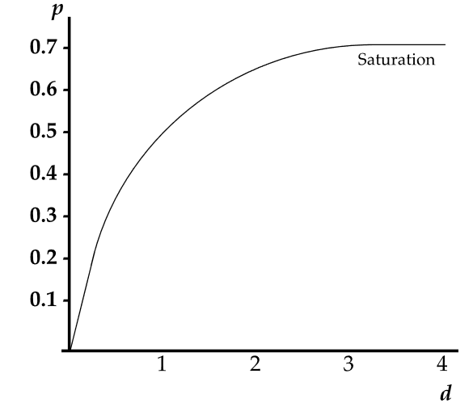
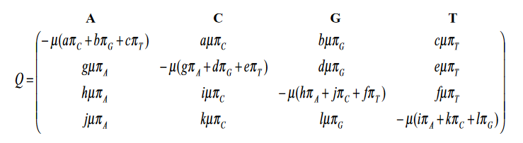
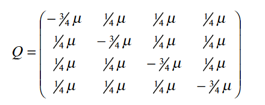

# Matriks Jarak Dengan Model Evolusi Jukes Cantor

---
Salah satu langkah pertama dalam analisis barisan nukleotida atau asam amino yang sudah selaras (alligned) biasanya adalah perhitungan matriks jarak genetik (atau jarak evolusi) antara semua pasangan barisan. Dalam bagian ini kita akan membahas dua hal. Pertama, apa definisi yang masuk akal dari jarak genetik, dan kedua, bagaimana mengestimasi jarak genetik menggunakan model statistik dari prosesj substitusi yang terjadi.

---

Sudah diketahui bahwa evolusi mempengaruhi barisan DNA. Sebagai hasilnya, barisan berubah dari waktu ke waktu. Oleh karena itu, dua barisan yang berasal dari nenek moyang yang sama dan berevolusi secara independen satu sama lain pada akhirnya akan berbeda. Ukuran dari perbedaan ini disebut jarak genetik. Jarak genetik memiliki peran penting dalam banyak aspek analisis barisan. Pertama, secara definisi, ia memberikan ukuran kesamaan (similarity metrics) antara barisan.

---

 Kedua, untuk barisan yang terkait oleh pohon evolusi, panjang cabang mewakili jarak antara simpul (barisan) dalam pohon. Oleh karena itu, jika jumlah pasti perbedaan barisan antara semua pasangan barisan dari satu set barisan diketahui, jarak genetik menyediakan dasar untuk membuat pohon evolusi yang menghubungkan barisan-barisan tersebut. Khususnya, jika barisan-barisan benar-benar berevolusi sesuai dengan pohon dan jika jarak genetik yang benar antara semua pasangan barisan tersedia, maka secara komputasi mudah untuk merekonstruksi pohon ini.

---

---

Substitusi nukleotida atau asam amino dalam barisan biasanya dimodelkan sebagai peristiwa acak. Oleh karena itu, prasyarat penting untuk menghitung jarak genetik adalah spesifikasi awal model substitusi, yang menyediakan deskripsi statistik dari suatu proses stokastik ini. Setelah model matematika substitusi diasumsikan, maka prosedur yang mudah ada untuk menyimpulkan jarak genetik dari data.

---

# Observed and expected distances

---

Pendekatan paling sederhana untuk mengukur perbedaan antara dua untai barisan DNA yang selaras adalah dengan menghitung jumlah situs di mana keduanya berbeda. Proporsi situs homolog yang berbeda disebut jarak yang diamati (observed distance), kadang-kadang juga disebut jarak-p, dan dinyatakan sebagai jumlah perbedaan nukleotida per situs.
Jarak p adalah ukuran yang sangat intuitif. Nmaun, jarak-p mempunyai ke: jika tingkat perbedaan tinggi, jarak p umumnya tidak sangat informatif terkait dengan jumlah substitusi yang sebenarnya terjadi. Hal ini dlisebabkan oleh efek berikut. 

---

katakanlah dua atau lebih mutasi terjadi secara berbarisan pada situs yang sama dalam barisan, misalnya, katakanlah A digantikan oleh C, dan kemudian oleh G. Akibatnya, meskipun dua penggantian telah terjadi, hanya satu perbedaan yang diamati (A menjadi G). Selain itu, dalam kasus mutasi balik (A menjadi C menjadi A) kita bahkan tidak akan mendeteksi adanya penggantian. Akibatnya, jarak yang diamati p underestimates jumlah substitusi yang sebenarnya terjadi.

---

---

Karena jarak genetik tidak dapat diamati secara langsung, teknik statistik ataupun aljabar matriks diperlukan untuk menyimpulkan kuantitas ini dari data. Misalnya, jarak genetik d akan dilakukan inference/disimpulkan langsung dari barisan menggunakan metode likelihood maksimum atau metode momen

---

# Nucleotide substitutions as a homogeneous Markov process

---
Proses substitusi nukleotida pada barisan DNA dapat ditinjau menjadi proses Markov dengan matriks Q yang menentukan laju relatif perubahan setiap nukleotida pada barisan. Bentuk umum dari matriks Q ditunjukkan pada Gambar di bawah.

---

---

 kolom kedua dari baris pertama adalah laju instan perubahan dari nukleotida A ke nukleotida C. Laju ini diberikan oleh hasil kali , laju substitusi instan rata-rata ($\mu$), kali frekuensi nukleotida A ($\pi_c$), kali a, parameter laju relatif yang menjelaskan seberapa sering substitusi A ke C terjadi selama evolusi dibandingkan dengan substitusi lain yang mungkin. Dengan kata lain, setiap entri non-diagonal dalam matriks mewakili proses subtitusi dari nukleotida $i$ ke $j$, sedangkan elemen diagonal dipilih agar jumlah setiap baris sama dengan nol karena mereka mewakili aliran total yang meninggalkan nukleotida i.

---

Model substitusi nukleotida seperti yang dirangkum oleh matriks Q pada Gambar termasuk ke dalam kelas model yang lebih umum dikenal sebagai model *time-homogeneous time-
continuous stationary Markov models*. Ketika diterapkan pada pemodelan substitusi nukleotida, semuanya memiliki asumsi dasar yang sama, yaitu:

---

1. Pada setiap situs dalam sebuah barisan, laju perubahan dari basa i ke basa j adalah independen dari basa yang sebelumnya menempati situs tersebut (sifat Markov).

2. Laju substitusi tidak berubah seiring waktu (homogenitas).

3. Frekuensi relatif dari A, C, G, dan T ($\pi_A$, $\pi_C$, $\pi_G$, $\pi_T$) berada pada keseimbangan (stasioner).

---

Asumsi-asumsi ini tidak selalu dapat dipenuhi secara biologis.hal ini terjadi akibat konsekuensi dari pemodelan substitusi sebagai proses stokastik. Dalam kerangka umum ini, kita masih dapat mengembangkan beberapa sub-model. Namun, dalam Pada makalah ini,l kita hanya akan memeriksa model yang disebut model *time-reversible*, yaitu model yang mengasumsikan untuk setiap:

Laju perubahannya dari i ke j selalu sama dengan dari j ke i ($a = g$, $b = h$, $c = i$, $d = j$, $e = k$, $f = g$ dalam matriks $Q$).

Setelah matriks $Q$, dan dengan demikian model evolusi, ditentukan, maka mungkin untuk menghitung probabilitas perubahan dari setiap basa ke basa lain selama waktu evolusi $t$, $P(t)$, dengan menghitung eksponensial matriks.

$$
\mathbf{P}(t)=\exp (\mathbf{Q} t)
$$

---

# The Jukes and Cantor (JC69) model

---

Model substitusi nukleotida yang paling sederhana, diperkenalkan oleh Jukes dan Cantor pada tahun 1969 (JC69). Pada model ini diasumsikan bahwa frekuensi keseimbangan dari keempat nukleotida adalah 25% masing-masing, dan selama evolusi setiap nukleotida memiliki probabilitas yang sama untuk digantikan oleh nukleotida lain. Asumsi-asumsi ini sesuai dengan matriks Q dengan $\pi_A = \pi_C = \pi_G = \pi_T = \frac{1}{4}$, dan $a = b = c = g = e = f = 1$.

---
 

 Matriks ini sepenuhnya menentukan laju perubahan antara pasangan nukleotida dalam model JC69. Untuk mendapatkan solusi analitis untuk $p$, kita perlu tahu bagaimana menghitung $P_{ii}(t)$, probabilitas nukleotida untuk tetap sama selama waktu evolusi $t$, dan $P_{ij}(t)$, probabilitas penggantian. Hal ini dapat dilakukan dengan memecahkan persamaan eksponensial $P(t) = \exp(Qt)$ (4.11), dengan $Q$ sebagai matriks laju instan untuk model JC69. Solusi untuk $P(t)$ adalah:

---

$$
\begin{aligned}
& P_{i i}(t)=1 / 4+3 / 4 \exp (-2\mu t) \\
& P_{i j}(t)=1 / 4-1 / 4 \exp (-2\mu t)
\end{aligned}
$$
 
Dengan pengunaan formula:
$$
e^{A t}=\sum_{n=0}^{\infty} \frac{t^n A^n}{n !}
$$

Dari persamaan-persamaan ini, kita dapat memperoleh untuk dua barisan yang berbeda t satuan waktu yang lalu:

$$
p=1-\sum_{i=1}^n \pi_i P_{i i}(t)
$$

$$
p=3 / 4[1-\exp (-2 \mu t)]
$$

$$
\mu t=-1 / 2 \log (1-4 / 3 p)
$$

---

Dengan demikian, sisi kanan memberikan jumlah substitusi yang terjadi pada kedua baris berasal dari asal yang sama. Interpretasi dari rumus di atas sangat sederhana. Dalam model JC69, $\frac{3}{4}\mu t$ adalah jumlah substitusi yang sebenarnya terjadi per situs (lihat matriks Q pada Gambar 4.4). Oleh karena itu, $d = 2 \left(\frac{3}{4} \mu t\right)$ adalah jarak genetik antara dua barisan yang berbagi leluhur. Di sisi lain, $p$ diinterpretasikan sebagai jarak yang diamati atau jarak $p$, yaitu proporsi yang diamati dari nukleotida yang berbeda antara dua barisan. Dengan mengganti $\mu t$ dengan $\frac{2}{3}d$ akhirnya kita memperoleh rumus koreksi Jukes dan Cantor untuk jarak genetik $d$ antara dua barisan:

$$
d=-3 / 4 \ln (1-4 / 3 p)
$$  
