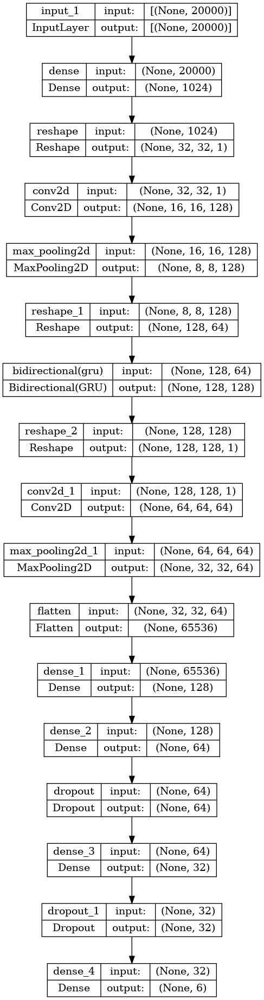
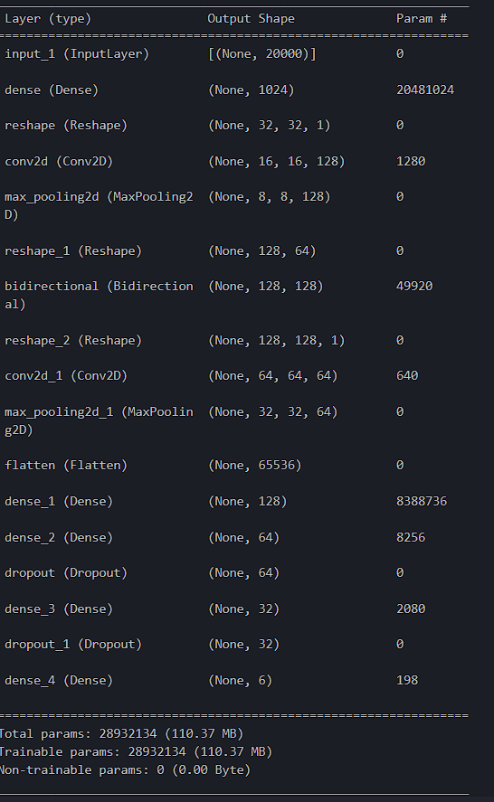

# Study Area

---

Dataset yang akan digunakan dalam penelitian ini berasal dari studi METABRIC yang dilakukan oleh Curtis dkk, pada tahun 2012. Dataset ini mencakup profil ekspresi gen dari koleksi yang luas yang terdiri dari 2331 sampel tumor payudara primer dan 150 sampel jaringan payudara normal. Dataset ini termasuk dalam salah satu kompilasi data kanker payudara terbesar yang pernah dianalisis. Untuk memudahkan efisiensi komputasi, kami memilih untuk fokus pada analisis selanjutnya terhadap 20.000 gen dengan variansi terbesar.

---

Selain itu, kami memilih untuk menggunakan subtipe PAM50, sebagaimana diperkenalkan oleh Parker dkk. pada tahun 2009. Subtipe ini berfungsi sebagai kerangka klasifikasi dalam membentuk model deep learning.

---

Penelitian METABRIC (Molecular Taxonomy of Breast Cancer International Consortium mengklasifikasikan dan mengelompokkan tumor kanker payudara guna lebih memahami karakteristik molekuler dan genetik dari penyakit ini.. Studi ini, yang diterbitkan pada tahun 2012, melibatkan analisis komprehensif sampel kanker payudara untuk mengidentifikasi subjenis molekuler yang berbeda. pengklasifikasian dengan subjenis-subjenis ini diharapkan akan berkontribusi pada pendekatan yang lebih personal dalam diagnosis dan pengobatan kanker payudara. Berikut adalah subjenis utama yang diidentifikasi dalam studi METABRIC:

---

1. Luminal A: Subjenis ini ditandai oleh ekspresi reseptor hormon (estrogen dan progesteron) dan ketiadaan amplifikasi HER2 (Human Epidermal Growth Factor Receptor 2). Tumor Luminal A biasanya memiliki prognosis yang lebih menguntungkan dan merespons dengan baik terhadap terapi berbasis hormon seperti tamoxifen.

---

2. Luminal B: Tumor Luminal B juga mengungkapkan reseptor hormon tetapi mungkin memiliki tingkat proliferasi yang lebih tinggi dan dapat menunjukkan amplifikasi HER2. Mereka cenderung terkait dengan prognosis yang lebih buruk dibandingkan dengan tumor Luminal A.

---

3. HER2-Enriched: Tumor HER2-enriched ditandai oleh overekspresi atau amplifikasi gen HER2. Tumor-tumor ini dapat agresif, tetapi terapi yang ditargetkan, seperti trastuzumab (Herceptin), telah dikembangkan untuk mengobatinya.

---

4. Basal-Like: Kanker payudara basal-like, juga dikenal sebagai kanker payudara triple-negatif, tidak memiliki ekspresi reseptor hormon (ER dan PR negatif) dan amplifikasi HER2. Mereka cenderung lebih agresif dan tidak merespons terapi hormon atau terapi yang ditargetkan pada HER2.

---

5. Normal-Like: Subjenis ini ditandai oleh profil ekspresi gen yang mirip dengan jaringan payudara normal. Ini adalah subjenis yang kurang umum dan mungkin memiliki prognosis yang lebih baik dibandingkan dengan subjenis lainnya.

---

---

# Model
---

Arsitektur deep learning yang digunakan merupakan arsitektur custom atas gabungan layer CNN, layer max pooling, Bidirectional Gru, dan fully connected layer atau dense layer. Gambar di bawah merupakan deskripsi arsitektur dalam bentuk tabel dan gambar.

---

---

