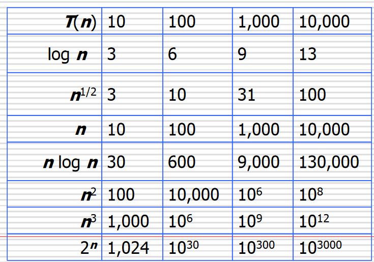
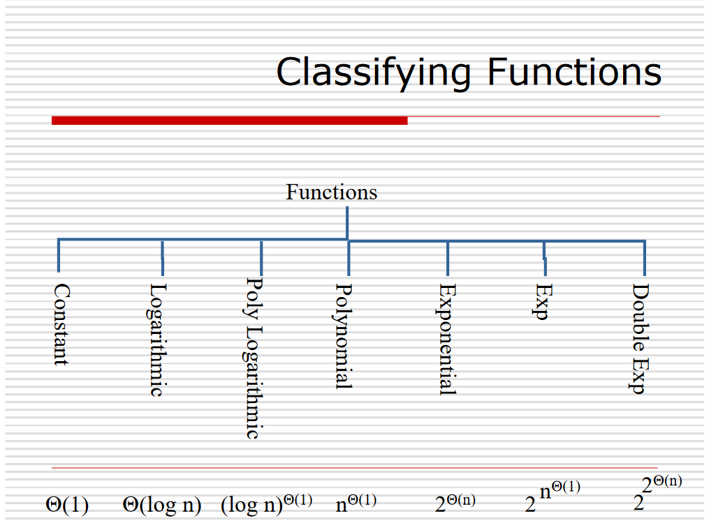

# Klasifikasi Kompleksitas Algoritma
Saya ingin menambahkan perihal klasifikasi dari fungsi kompleksitas algortima.

Dalam menganalisis suatu algoritma, meskipun dapat dicari tahu secara akurat berapa nilai kompleksitas waktu ($T(n)$) dan kompleksitas ruang ($S(n)$) dari algoritma tersebut, namun seringkali kita hanya tertarik pada nilai kompleksitasnya secara asimtotik atau biasa disebut *order of growth*. Dengan hanya memfokuskan penganalisisan algoritma pada *order of growth*, kita dapat mengklasifikasikan fungsi-fungsi yang merepresentasikan kompleksitas algoritma menjadi lebih sederhana. Dalam hal ini, kita dapat menggunakan notasi Big-O, Big-Theta, dan Big-Omega.

Gambar 1. Pengklasifikasian kompleksitas algoritma berdasarkan order of growth memudahkan perhitungan komputasi yang dilakukan.

Secara definisi matematis, notasi Big-O, Big-Theta, dan Big-Omega dapat didefinisikan sebagai berikut:

$$
\begin{align}
O(g(n)) &= \{f(n) : \exists c > 0, n_0 > 0, \forall n \geq n_0, 0 \leq f(n) \leq cg(n)\} \\
\Theta(g(n)) &= \{f(n) : \exists c_1 > 0, c_2 > 0, n_0 > 0, \forall n \geq n_0, 0 \leq c_1g(n) \leq f(n) \leq c_2g(n)\} \\
\Omega(g(n)) &= \{f(n) : \exists c > 0, n_0 > 0, \forall n \geq n_0, 0 \leq cg(n) \leq f(n)\}
\end{align}
$$

Atau secara definisi limitnya dapat didefinisikan sebagai berikut:

$$

\begin{align}
O(g(n)) &= \{f(n) : \lim_{n \to \infty} \frac{f(n)}{g(n)} \leq c\} \\
\Theta(g(n)) &= \{f(n) : \lim_{n \to \infty} \frac{f(n)}{g(n)} = c\} \\
\Omega(g(n)) &= \{f(n) : \lim_{n \to \infty} \frac{f(n)}{g(n)} \geq c\}
\end{align}
$$

Secara sederhana dapat diartikan bahwa:
1. Big-O: menunjukkan kelas *order-of-growth* yang menjadi  upper bound dari kompleksitas algoritma yang dianalisis.
2. Big-Omega: menunjukkan kelas *order-of-growth* yang menjadi lower bound dari kompleksitas algoritma yang dianalisis.
3. Big-Theta: menunjukkan kelas *order-of-growth* yang menjadi upper bound dan lower bound dari kompleksitas algoritma yang dianalisis.

Dalam mengklasifikan kompleksitas algoritma, pengunaan Big-Theta jauh lebih sering digunakan dibandingkan Big-O dan Big-Omega.

Meskipun kita dapat menggunakan definisi matematis untuk mengklasifikasikan kompleksitas algoritma, namun dalam prakteknya, kita dapat menggunakan aturan-aturan berikut untuk mengklasifikasikan kompleksitas algoritma:

1. Abaikan *low-order* terms berarti bahwa kita hanya tertarik pada fungsi yang memiliki "nilai yang mendominasi" ketika n menuju takhingga. Sebagai contoh, jika kita memiliki fungsi $f(n) = 3n^2 + 5n + 2$, maka kita hanya tertarik pada fungsi $f(n) = 3n^2$ saja. Hal ini dikarenakan fungsi $f(n) = 3n^2$.
2. Abaikan konstanta-konstanata pengali pada fungsi.

Dengan mengikuti r*ule of thumb* tersebut,

$$
\begin{align}
f(n) &= 0.001n^2 \\
g(n) &= 1000n^2 \\
h(n) &= 5n^2 + 3n + 2logn
\end{align}
$$

merupakan fungsi yang memiliki kompleksitas yang sama, yaitu $\Theta(n^2)$.
Dan fungsi-fungsi berikut:
$$
\begin{align}
f(n) = 2^n \\
g(n) = 2^{0.0001n} \\
h(n) = 2^{10000n} \\ 
i(n) = 8^n = 2^{3n} \\
j(n) = 2^{n/100} \\
k(n) = 2^n \cdot n^{100} 
\end{align}
$$

merupakan fungsi yang memiliki kompleksitas yang sama, yaitu $\Theta(2^n)$ atau $2^{\Theta(n)}$.

Gambar 2. Pengklasifikasian fungsi-fungsikompleksitas algoritma berdasarkan order of growth (Big-Tehta).

