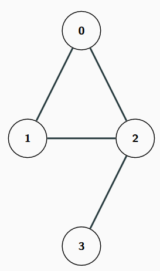

# Multi columns in Marp slide

<div class="columns">
<div>

## Column 1

Lorem ipsum dolor sit amet consectetur adipisicing elit. Voluptas eveniet, corporis commodi vitae accusamus obcaecati dolor corrupti eaque id numquam officia velit sapiente incidunt dolores provident laboriosam praesentium nobis culpa.

</div>
<div>

<p align="center">
    
</p>
</div>

</div>

---
<span style="color:orange">
0: 1

1: 2
2: 0, 1, 3
3:
</span>


```cpp

vector<int> adj[4];
adj[0].push_back(1);
adj[0].push_back(2);
adj[1].push_back(0);
adj[1].push_back(2);
adj[2].push_back(0);
adj[2].push_back(1);
adj[2].push_back(3);
adj[3].push_back(2);

```

